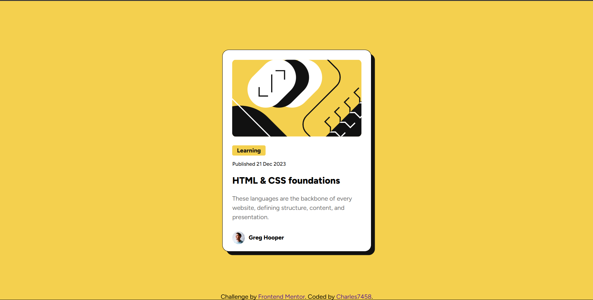

# Frontend Mentor - Blog preview card solution

This is a solution to the [Blog preview card challenge on Frontend Mentor](https://www.frontendmentor.io/challenges/blog-preview-card-ckPaj01IcS). Frontend Mentor challenges help you improve your coding skills by building realistic projects.

## Table of contents
  - [Overview](#overview)
  - [Screenshot](#screenshot)
  - [Links](#links)
  - [Built with](#built-with)
  - [What I learned](#what-i-learned)
  - [Continued development](#continued-development)
  - [Author](#author)

## Overview

### The challenge

Users should be able to:

- See hover and focus states for all interactive elements on the page

### Screenshot

### Links

- Solution URL:  (https://github.com/Charles7458/blog-preview-solution)
- Live Site URL: (https://charles7458.github.io/blog-preview-solution/)

### Built with

- Semantic HTML5 markup
- CSS custom properties

### What I learned

I learned how to use margin and padding to position and give spacing between elements. 

### Continued development

I always find it difficult to position things in the page. I will learn css well to learn how to position things.

## Author

- Frontend Mentor - [@Charles7458](https://www.frontendmentor.io/profile/Charles7458)

